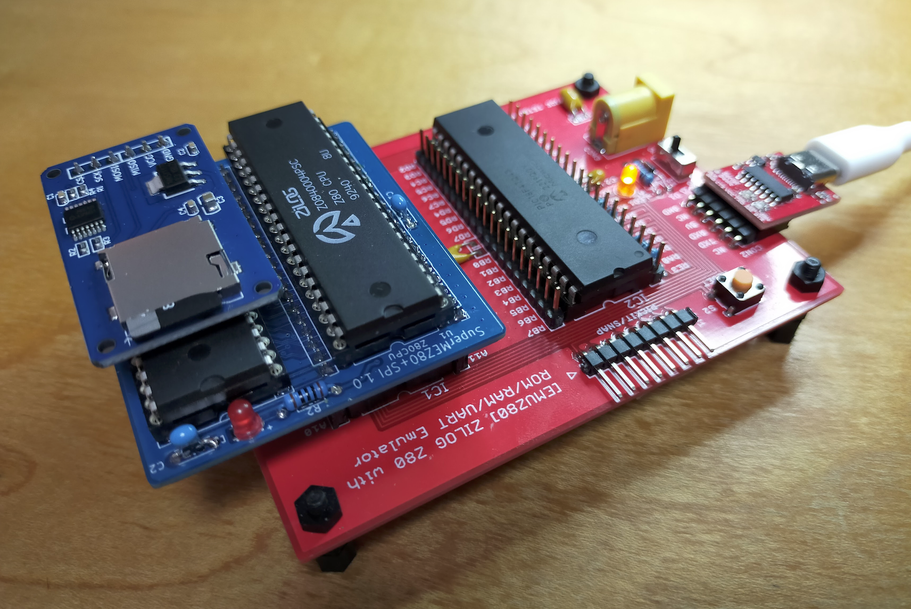
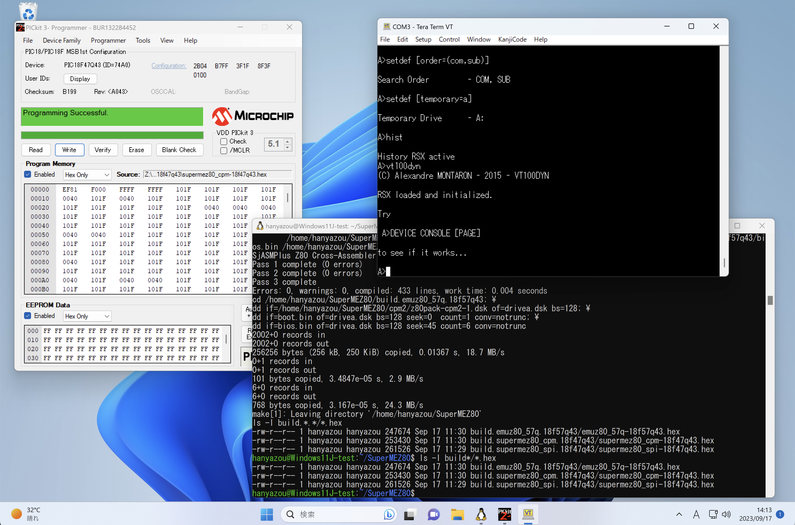
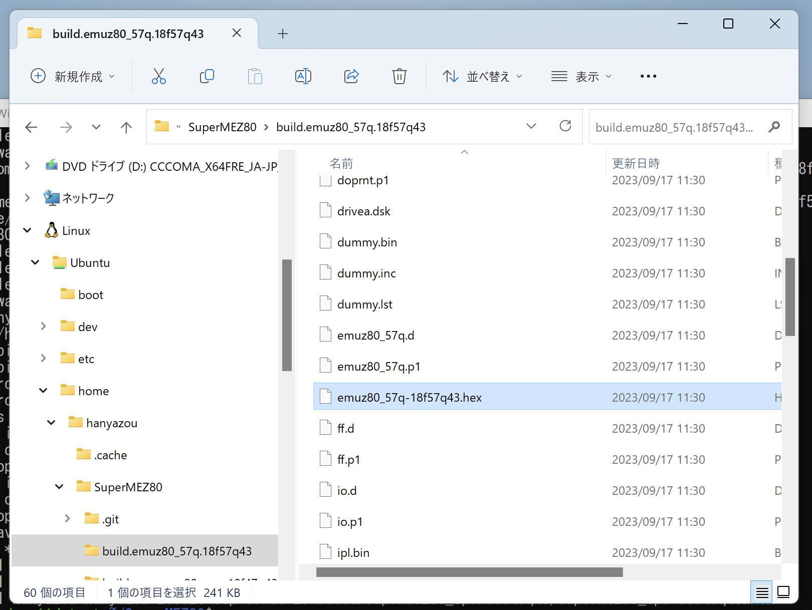
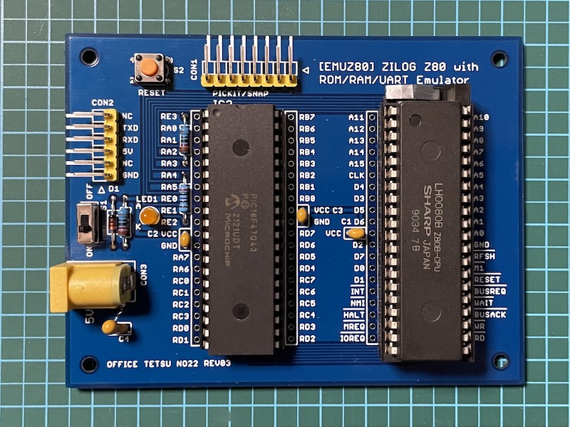
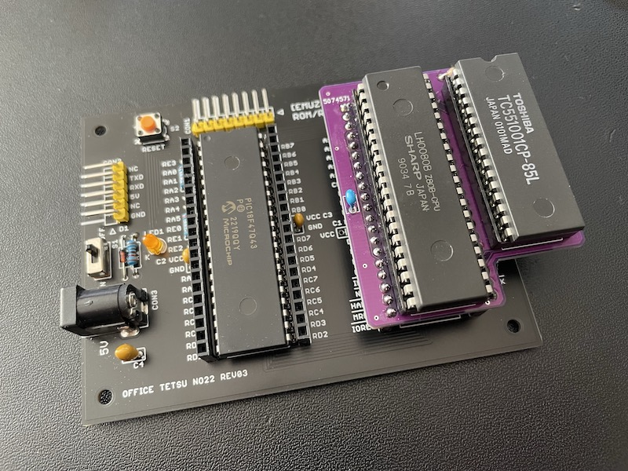

# Firmware for SuperMEZ80-SPI/-CPM

EMUZ80用のメザニンボードSuperMEZ80用のファームウェアです。
SRAMとSD Card slotで、EMUZ80でCP/Mを動作させることができます。

## 特徴

* Satoshi Okueさん(@S_Okue)さんのSuperMEZ80にSD Card slotを追加してしています
* z80pack(https://github.com/udo-munk/z80pack) のSIMとある程度互換性のあるI/Oを実装しているため、
z80packのCP/Mのディスクイメージを起動することができます。  
（全てのI/Oが実装されているわけではありません）
* SuperMEZ80同様に、RAMの制御信号とIOアクセスのWAIT信号をPICのCLC(Configurable Logic Cell)機能で
作成しています。
* Z80に割り込み機能を使って、Z80動作中にPICからレジスタやメモリを読み出すことができます。
* 基板依存部分をsrc/boards以下に分離しており、EMUZ80と似た構成の基板への移植が容易です。

  
Z80 Single-Board Computer EMUZ80 と SuperMEZ80-SPI

## メザニンボード
複数のボードに対応しています。ビルド時の指定で切り替えます。

### MEZ80SD
Satoshi Okueさん(@S_Okue)さんのMEZ80RAMとEMUZ80-LEDを元にSPIインターフェースを追加し、SD Card slotを使えるようにしたもの。
オリジナルのMEZ80RAMと異なり、PICとSPIの/CSを接続する代わりにPICとZ80のA15が接続されていません。
このため、CP/Mを起動するには、DMA(Direct Memory Access)でなくPIO(Programmed I/O)のディスクアクセスを行う必要があります。  
https://github.com/satoshiokue/MEZ80SD  
ビルドパラメータ: BOARD=SUPERMEZ80_SPI PIC=18F47Q43

### SuperMEZ80-SPI
I/O expanderで、メモリのバンク切り替えや、NMIを使用することができます。
MEZ80SDではPICとSRAMのA14が接続されていますが、これを諦めて代わりにSPIの/CSに使用することにより、I/O expander (MCP23S08)を接続しています。
SPIのMOSI/MISO/SCKはZ80のデータバスと共用です。  
https://github.com/hanyazou/SuperMEZ80-SPI  
ビルドパラメータ: BOARD=SUPERMEZ80_SPI PIC=18F47Q43

### SuperMEZ80-CPM
I/O expanderなしで、メモリのバンク切り替えや、NMIを使用することができます。
部品点数が少なく、シンプルで組み立てやすい基板です。
構造が単純かつ、SD Card slotとZ80のデータバスを共有していないため、
SuperMEZ80-SPIより高いクロックで動作できます。
Z84C0020(20MHz版)との組み合わせで、PICのNCOで設定できる最高の16MHzでCP/M 3.0の動作実績があります。  
https://github.com/hanyazou/SuperMEZ80-CPM  
ビルドパラメータ: BOARD=SUPERMEZ80_CPM PIC=18F47Q43

### EMUZ80-57Q
@Gazelle8087 さんのEMUZ80強化版シングルボードコンピュータです。
オリジナルEMUZ80のPIC 18F47Q(40ピン)の代わりにPIC 18F57Q(48ピン)を使うことにより、
I/O expanderなしでSD Card slotのためのSPIと、Z80のアドレスバスA0~A15を接続しています。
残念ながらバンク切り替え機能がないので、SRAMは64KBまでです。  
https://twitter.com/Gazelle8087/status/1651571441727578112  
ビルドパラメータ: BOARD=EMUZ80_57Q PIC=18F57Q43

## ビルド

### ビルドの概要

* macOSかLinuxでビルドできます
* Windowsの場合、WSL2(Windows Subsystem for Linux)であればLinuxと同じ手順でビルドできます
* PIC18用のコンパイラ(XC8)を使います
* 以下のように make を実行すると、
PIC に書き込み可能なbuild.<基板名>.<PIC種別>/<基板名>-<PIC種別>.hexが作成されます
```
% git clone https://github.com/hanyazou/SuperMEZ80
% cd SuperMEZ80
% git submodule update --init --recursive
% make BOARD=SUPERMEZ80_CPM PIC=18F47Q43

% ls build.*.*/*.hex
-rw-r--r--  1 hanyazou  staff  218386 Aug 29 17:45 build.supermez80_cpm.18f47q43/supermez80_cpm-18f47q43.hex
```

### Linux

ubuntu などの代表的なディストリビューションでビルドできます。
あらかじめ以下のようにして必要なパッケージをインストールしてください。

```
$ sudo apt update
$ sudo apt install build-essential curl xxd
```

MICROCHIPの
[Downloads Archive](https://www.microchip.com/en-us/tools-resources/archives/mplab-ecosystem)
からXC8コンパイラをインストールしてください。

開発および動作確認には、xc8 v2.36 を使用しています。
[xc8-v2.36-full-install-linux-x64-installer.run](https://ww1.microchip.com/downloads/aemDocuments/documents/DEV/ProductDocuments/SoftwareTools/xc8-v2.36-full-install-linux-x64-installer.run)
をダウンロードして、以下のように実行し、表示される手順に従ってインストールしてください。
インストールの詳細については
[Installing MPLAB® XC8 C Compiler](https://microchipdeveloper.com/xc8:installation)
を参照してください。

```
$ chmod +x xc8-v2.36-full-install-linux-x64-installer.run
$ sudo ./xc8-v2.36-full-install-linux-x64-installer.run
```

### Mac

XcodeやHome brewなどの一般的な開発環境に加えて、
MICROCHIPの
[Downloads Archive](https://www.microchip.com/en-us/tools-resources/archives/mplab-ecosystem)
からXC8コンパイラをインストールしてください。

開発および動作確認には、xc8 v2.40 を使用しています。
[xc8-v2.40-full-install-macos-x64-installer.dmg](https://ww1.microchip.com/downloads/aemDocuments/documents/DEV/ProductDocuments/SoftwareTools/xc8-v2.40-full-install-macos-x64-installer.dmg)
をダウンロードして、インストールしてください。
インストールの詳細については
[Installing MPLAB® XC8 C Compiler](https://microchipdeveloper.com/xc8:installation)
を参照してください。

### Windows

SuperMEZ80のビルドは、UNIX/LinuxスタイルのMakefileによって行われています。
Windowsに、WSL(Windows Subsystem for Linux)をインストールすることにより、
LinuxやMacと同じ手順でファームウェアをビルドすることができます。



管理者権限で wsl --install を実行すると
デフォルトで WSL2 ubuntu がインストールされます。
追加の設定などは必要ありません。
[WSL を使用して Windows に Linux をインストールする方法](https://learn.microsoft.com/ja-jp/windows/wsl/install)
に従ってWSLをインストールしてください。

WSLでmakeを実行してファームウェアを作成すると、
\\\\wsl.localhost\\Ubuntu\\home\\hanyazou\\SuperMEZ80\\build...のあたりに.hexファイルができます。
("hanyazou"の部分は、WSLインストール時に指定したLinuxのユーザ名になります)
\\\\wsl.localhost\\Ubuntuを適当なネットワークドライブに割り当てておくと良いでしょう。



### Docker

[Docker](https://www.docker.com/)を使用して、
ビルド時のホスト環境の違いによる影響を最小限にすることができます。

以下のようにdocker/build_env.shスクリプトを使用してmakeを実行するとubuntu 22.04のコンテナを
使ってビルドを実行します。

```
$ ./docker/build_env.sh make realclean test_build
```

初回実行時は、
ファームウェアのビルドの前にubuntuイメージの構築とXC8のインストールが行われます。
コマンドを実行した端末にXC8のライセンス条件などが表示されるのでよく読んで
Y/Nなどを入力してください。

## PICプログラムの書き込み
以下の書き込みツールのいずれかを使用して
ビルドしたファームウェアをEMUZ80上のPICマイコンに書き込みます。

* PICkit  
PICマイコンのMICROCHIP社純正ツールです。EMUZ80で使用するPIC 18Fに書き込むためには、PICkit 4以降の比較的新しいものが必要です。
（PICkit 2及び3は対応していません）  
https://www.microchip.com/en-us/development-tool/PG164140
* PICkit minus  
PICkit 2及び3を使ってPIC 18Fに書き込むことができるソフトウェアです。  
http://kair.us/projects/pickitminus/
* Arduino-PIC-Programmer  
Arduino UNOを用いてPICを書き込みます。  
https://github.com/satoshiokue/Arduino-PIC-Programmer
* a-p-prog  
上記Arduino-PIC-Programmerの元になったツールです。
make upload を実行すると、こちらの a-p-prog を利用してPICにファームウェアを書き込みます。  
https://github.com/hanyazou/a-p-prog

## Z80プログラムの格納
SuperMEZ80ではインテルHEXデータを配列データ化して配列rom[]に格納すると0x0000に転送されZ80で実行できます。
SuperMEZ80-SPI用のファームウェアでは、rom[]に小さなプログラム(ipl.z80)が格納されいます。
これが実行されるとSDカードのディスクイメージの最初のセクタを読み込んで実行されます。

SDカードのディスクイメージは、
SDカードにCPMDISKSというフォルダを作成し、
ファームウェアをビルドしてできたbuild/drivea.dskをコピーしておきます。
SDカードにCPMDISKSで始まる名前のフォルダが複数ある場合は、起動時に以下のように出力されるので、どれを使用するのか選択します。
```
Memory 000000 - 010000H 64 KB OK
0: CPMDISKS
1: CPMDISKS.3
2: CPMDISKS.PIO
M: Monitor prompt
Select: 
```

注意: SDカードはFAT32でフォーマットされている必要があります。
32GB以上の容量のSD XCで使用されるexFAT(FAT64)はサポートされません。
32GBより小さいサイズのSD HCカードを使用するか、またはPCなどでFAT32で再初期化したものを使用してください。

### ディスクイメージの修正について
build/drivea.dskは、z80packのCP/M 2.2用起動ディスクを修正したものです。
ディスクの読み書きをDMAでなく、プログラムI/Oに変更しています。
I/O expanderを使用できない場合は、CP/Mの起動にこのプログラムI/Oの修正が必要です。
具体的な修正内容は、同じフォルダのboot.asm, bios.asmの履歴を参照してください。
置き換え手順はMakefileを参照してください。

SuperMEZ80-SPI I/O expander付きなどを使用する場合は、
z80packのCP/M起動ディスクを無修正で使うことができます。
(プログラムI/Oも使用できます)

SuperMEZ80-SPI  I/O expander付きおよびSuperMEZ80-CPMでは、
AS6C4008などの2Mbit(256KB)以上のSRAMとの組み合わせで
banked biosのCP/M 3.0を起動することができます。

ディスクイメージの詳細は、udo-munk/z80packを参照してください。
https://github.com/udo-munk/z80pack

## サポート状況

| 基板           | RAM最大 | SD Card slot | CP/M 2.2 PIO | CP/M 2.2 DMA | CP/M 3.0 | モニタ | テスト     |
| ---            | ---     | ---          | ---          | ---          | ---      | ---    | ---        |
| SuperMEZ80-SPI | 512KB   | available    | ok           | ok           | ok       | ok     | 毎リリース |
| SuperMEZ80-CPM | 256KB   | available    | ok           | ok           | ok       | ok     | 毎リリース |
| EMUZ80-57Q     | 64KB    | available    | ok           | ok           | n/a      | ok     | cpm-v2.4.0 |
| MEZ80SD        | 64KB    | available    | ok           | n/a          | n/a      | n/a    | cpm-v1.0.0 |

## 謝辞
シンプルで美しいEMUZ80を開発された電脳伝説さんに感謝します。  
Z80Bを6MHzノーウェイトで動かしたSatoshi Okueさんに感謝します。  
またSPI接続もSatoshi OkueさんのMEZ80LEDを参考にしました。  

## ライセンス
元のソースコードは電脳伝説さんのmain.cを元に改変してGPLライセンスに基づいて公開されています。
新たに追加したソースコードは、扱いやすいようにMITライセンスです。
各ファイル冒頭のライセンスを参照してください。

## リファレンス
### EMUZ80
EUMZ80はZ80CPUとPIC18F47Q43のDIP40ピンIC2つで構成されるシンプルなコンピュータです。



電脳伝説 - EMUZ80が完成  
https://vintagechips.wordpress.com/2022/03/05/emuz80_reference  
EMUZ80専用プリント基板 - オレンジピコショップ  
https://store.shopping.yahoo.co.jp/orangepicoshop/pico-a-051.html

### SuperMEZ80
SuperMEZ80は、EMUZ80にSRAMを追加し、Z80をノーウェイトで動かすことができるメザニンボードです



SuperMEZ80
https://github.com/satoshiokue/SuperMEZ80
